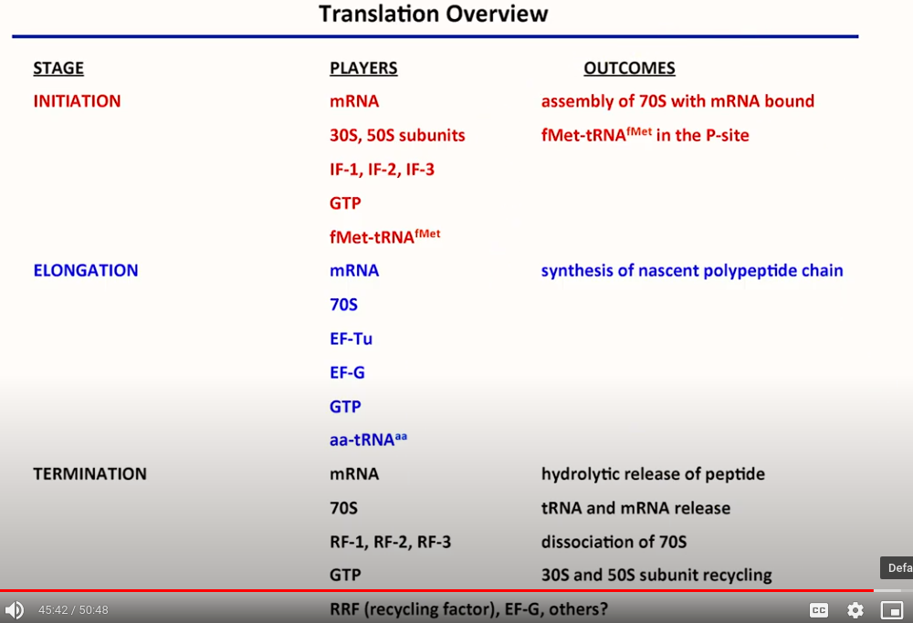

# Lecture 2: Protein Synthesis I

## Module overview
- What do we learn from structural studies of the ribosome? What does the structure tell us about function?
- How does the ribosome recognize, bind, and decode mRNA?
- How are amino acids recognized and delivered to the ribosome?
- How is the correct amino acid selected and delivered?
  - What happens if the wrong amino acid is delivered?
- How is translation initiated?
- How does the ribosome catalyze peptide bond formation?
- How does the polypeptide leave the ribosome? What happens to the polypeptide as it exits?
- How is translation terminated? What happens to the ribosome thereafter?
- How does our understanding of the ribosome allow for the development of new technologies?

## Agenda
1. Ribosome structure
2. Overview of translation initiation
3. Amino acid delivery to the ribosome by aa-tRNAaa and fidelity of amino acid selection

## Translation - Key players
1. Ribosome
  - reads the genetic code via mRNA
  - catalyzes peptide bond formation
2. mRNA
  - _delivers_ the genetic code to the ribosome
  - provides a _template_ for protein synthesis (template driven polymerization)
3. tRNA
  - _deliver_ amino acid monomers to the ribosome
  - _transfer_ amino acids during polypeptide synthesis
4. Translation factors
  - proteins required at specific points during translation
  - **initiation factors** (in pky: IF1, 2, 3)
  - **elongation factors** (in pky: EF-Tu, EF-G, others)
  - **release factors** (in pky: RF1, 2, 3)
  - **ribosome recycling factor**. recycles subunits
  - **trigger factor**. involved in folding of nascent polypeptide chain

## Stages of translation
1. Initiation
2. Elongation (the elongation cycle is highly conserved)
3. Termination
  - Peptide release
  - Ribosome recycling

## Prokaryotic 70S ribosome
- comprised of RNA and proteins; ~66% RNA, 34% protein by mass
- comprised of subunits
  - 50S - large subunit
    - 23S rRNA + 5S rRNA + proteins (n = 30)
    - ~1.5 megadalton
    - catalytic center = peptidyl transferase center (PTC)
    - 3 sites for tRNA binding
  - 30S - small subunit
    - 16S rRNA + proteins (n = 21)
    - ~0.8 megadalton
    - decoding center
    - site for mRNA binding

### 50S subunit
- surface is covered by a **protein lattice**
  - primary role of proteins are to stabilize the 3D structure of RNA
  - 13 of surface proteins are unfolded and extend into the center
    - the positively charged amino acids form salt bridges with the phosphate backbones
- 23S rRNA
  - contains six domains of rRNA
- PTC center
  - **devoid of protein!** nearest protein is 18 angstrom away
  - closest Mg atom is 8 angstrom away
    - RNA catalyzes the peptide bond formation (domain 5)
  - A site. binds **a**minoacyl-tRNAs (except initiator tRNA)
  - P site. binds initiator tRNA and **p**eptidyl-tRNA (growing chain)
  - E site. binds deacylated tRNA (**e**xit site)
- 50S subunit contains an exit tunnel
  - 100 angstrom long and 15 angstrom in diameter (avg)
  - folding happens after peptide exits

### 30S subunit
- 16S rRNA contains **4 domains**
  - binds **Shine-Dalgarno** sequence of mRNA
  - binds with 23S rRNA from 50S subunit
  - highly conserved among bacterial species
  - in E. coli, 16S rRNA = 1542 nt

- Mg atoms are important in mediate interaction between subunits
- Subunits join at about 12 sites

## Overview of translation
- mRNA read in 5' -> 3'
- synthesized in N -> C
- GTP hydrolysis provides a way to convert chemical energy to mechanical energy
- Some ribosome rates
  - 6-20 peptide bonds per second
  - error rate <1/1000
  - 10^7 fold rate acceleration

